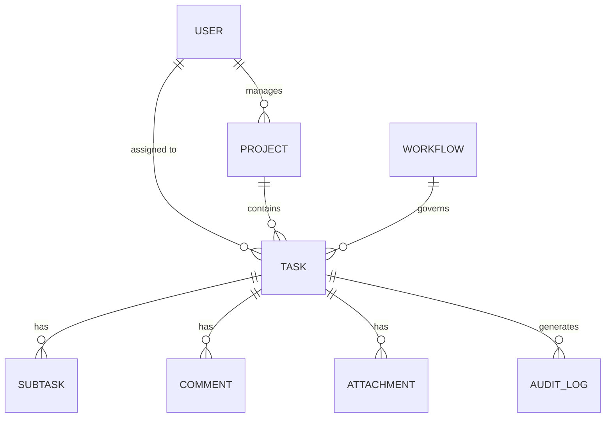

# Phase 0: Foundation & Planning

## 1. Requirements Document
**Task Automation** means:
- Creating, assigning, and tracking tasks.
- Setting up recurring tasks based on time (e.g., daily, weekly).
- Rule-based triggers (e.g., if a task is overdue, notify the manager).
- Automated workflows and dependencies (Task B unlocks when Task A completes).

## 2. User Roles
- **Admin**: Full control over the system, billing, and all users.
- **Manager**: Can create/assign tasks, build workflows, and view team reports.
- **Member**: Can view, update, and comment on their assigned tasks.
- **Guest (Viewer)**: Read-only access to specific projects or tasks.

## 3. Data Model Draft (ER Diagram)

## 4. Tech Stack Locked
- **Backend Framework**: Django + Django REST Framework (DRF)
- **Database**: PostgreSQL
- **Caching & Brokers**: Redis
- **Background Tasks**: Celery
- **Infrastructure**: Docker & docker-compose

## 5. API Design Draft
- **Architecture**: RESTful API
- **Base URL**: `/api/v1/`
- **Key Endpoints**:
  - `/api/v1/auth/` (Login, Register, Refresh)
  - `/api/v1/users/` (Profile, Role management)
  - `/api/v1/projects/` (CRUD projects)
  - `/api/v1/tasks/` (CRUD tasks, assignment, status updates)
  - `/api/v1/workflows/` (Automations and rules)

## 6. Environments Planned
- **Development**: Local Docker setup (hot-reloading, local DB).
- **Staging**: Replica of production for QA and testing.
- **Production**: Live environment with strict security, separated DB, and secrets management.

## 7. Features to Lock In (Proposed)
- **Authentication**: JWT (JSON Web Tokens) for stateless, scalable auth.
- **Multi-tenancy**: Yes (Grouping by Organization/Workspace so different companies can use it).
- **Real-time**: WebSockets (using Django Channels) for instant notifications and live updates.
